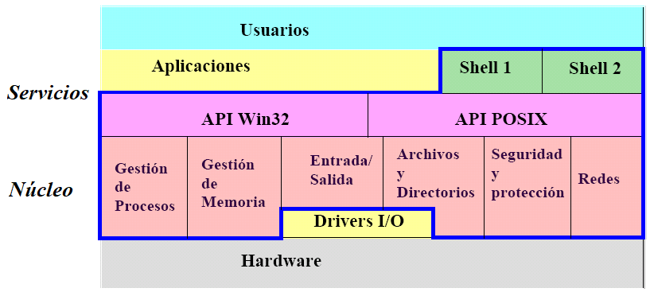
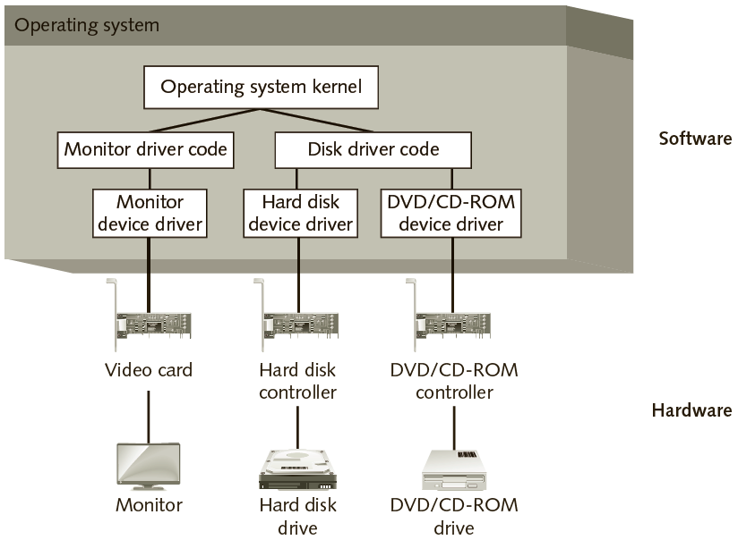
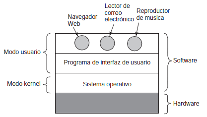
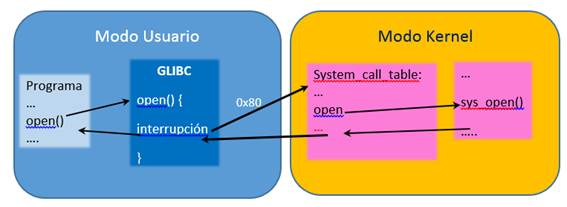

Componentes del Sistema Operativo
=================================

El sistema operativo está conformado por los componentes que ponemos
observar en la Figura 12:

   Figura 12 Componentes de los Sistemas Operativos

Como vemos en la figura, todo sistema operativo debe encargarse de al
menos los siguiente componentes dentro de él:

- Gestión de procesos.
- Gestión de memoria.
- Gestión de la E/S.
- Gestión de archivos y directorios.
- Seguridad y protección.
- Redes.
- Un Intérprete de comandos (*shell*).

Gestión de Procesos
-------------------

Los usuario necesitan iniciar y finalizar programas. Son los programas los que
permiten verle una utilidad a los computadores, y un **Proceso** no es más que
un programa en ejecución. Es por eso que se necesita una forma sistemática de 
supervisar y controlar los distintos programas que pueden estar ejecutándose 
en el procesador. Se le deben asignar recursos (procesador, memoria, dispositivos 
de E/S, archivos, etc.). 

Responsabilidades:
^^^^^^^^^^^^^^^^^^
+ Creación y destrucción de procesos.
+ Suspensión y reanudación de procesos.
+ Mecanismos de sincronización de procesos.
+ Mecanismos de comunicación entre procesos (IPC).

Gestión de la Memoria Principal
-------------------------------

Los usuarios necesitan un entorno informático que de soporte a la programación 
modular y la utilización flexible de los datos. Los administradores de  sistemas 
necesitan un control eficiente y ordenado de la asignación del almacenamiento. Y
los procesos necesitan un espacio en memoria principal donde van a llevar
a cabo su ejecución.

Responsabilidades:
^^^^^^^^^^^^^^^^^^

- Registrar el uso de la memoria (partes libres y asignadas, además quién las está usando).
- Decidir qué proceso cargar en la memoria.
- Asignar y liberar memoria según necesidad.

Gestión de la Memoria Secundaria
--------------------------------

Permite ampliar la capacidad de la Memoria Principal. Gracias a la memoria secundaris
se mantiene un respaldo de datos y programas presentes en la Memoria Principal.

Responsabilidades:
^^^^^^^^^^^^^^^^^^

- Gestión del espacio libre.
- Asignación de memoria.
-  Planificación del disco.

Gestión del Sistema de Entrada/Salida (E/S)
-------------------------------------------

El Sistema Operativo debe ocultar al usuario las particularidades de 
los dispositivos del hardware. Abstraer los dispositivos físicos mediante 
controladores de dispositivos. 

         la comunicación el SO y el hardware.

   Figura 13 Los controladores de dispositivos [Tomado de (Tomsho, 2015)]

Responsabilidades:
^^^^^^^^^^^^^^^^^^
- Sistema de buffering y caching de datos.
- Interfaz genérica para los dispositivos (especie de polimorfismo 
  para las interfaces de drivers).
- Implementaciones específicas de cada dispositivo.

Gestión de Archivos
-------------------

Archivo es un conjunto de información relacionada definida por su creador. Gracias
a los archivos podemos abstraer los medios de almacenamiento y comunicación. Y si
estamos en sistemas multiusuario, es deber del sistema operativos protegerlos de
accesos indebidos.

Responsabilidades:
^^^^^^^^^^^^^^^^^^
- Crear y destruir archivos y directorios.
- Operaciones de manipulación de archivos y directorios.
- Mapeo del archivo en dispositivos de almacenamiento.
- Respaldo de archivos.

Seguridad y Protección de la Información
---------------------------------------- 

El crecimiento de la utilización de los sistemas de tiempo compartido y  de
las redes han traído un aumento de las preocupaciones por la protección  de la
información. Es por eso que se debe garantizar acceso seguro de procesos
autorizados a ciertos recursos y deben haber mecanismos para definir políticas
de seguridad y poder controlarlas.

Responsabilidades:
^^^^^^^^^^^^^^^^^^
- Control de acceso: tiene que ver con la regulación del acceso del usuario al 
  sistema completo, a los subsistemas y a los datos, así como a regular el acceso
  de los procesos a los recursos y objetos del sistema.
- Control del flujo de información: regula el flujo de datos dentro del sistema 
  y su distribución a los usuarios.
- Certificación: es relativa a la demostración de que el acceso y los mecanismos 
  de control del flujo se llevan a cabo de acuerdo a las especificaciones y a 
  que éstas cumplan las políticas de protección y seguridad deseadas. 

Interpretador de Comandos (*Shell*)  
-----------------------------------

- Interfaz básica del usuario con el sistema
- Permite al usuario ejecutar programas y controlar su ejecución.
- En los sitemas basados en Unix se le denomina *Shell*
- En el mundo Windows tenemos el COMMAND.COM y el PowerShell
- Existen lenguajes de comando  (script) e interfaces más amigables (sistemas de ventanas).

Servicios, Llamadas al Sistema (*API*)
--------------------------------------

Una llamada al sistema es un mecanismo mediante el cual un proceso solicita
un servicio del Sistema Operativo.

Modos de Operación
------------------

Sobre todo en sistemas de múltiples usuarios, hay que considerar temas de
protección de memoria y de ejecución de instrucciones privilegiadas. Es
gracias a esto que surge el tema de *Modos de Operación*.

   Figura 14 Modos de un Sistema Operativo

A partir de la gráfica anterior podemos, entonces, encontrar las funcionalidades
del sistema operativo en cada modo, así:

El modo Kernel 
    Constituye un modo privilegiado de ejecución; en este modo no se
    impone ninguna restricción al Kernel del sistema, puede utilizar todas las
    instrucciones del procesador, manipular toda la memoria, dialogar con todos los
    controladores de dispositivo, etc.

El modo Usuario 
    es el modo de ejecución normal de un proceso; en este modo el
    proceso no posee ningún privilegio: ciertas instrucciones están prohibidas, solo
    tiene acceso a las zonas de memoria que se le han asignado, y no puede interactuar
    con el hardware.

Un proceso que se ejecuta en modo usuario no puede acceder directamente a los
recursos de la máquina (hardware), para ello debe de efectuar llamadas al sistema.
Una llamada al sistema es una petición trasmitida por un proceso al Kernel, este
último trata la petición en un modo Kernel con todos los privilegios, y envía los
resultados al proceso que prodigue su ejecución normal. Esto se conoce como un
*Cambio de Estado*.

         

   Figura 15 Llamadas al Sistema y los Modos de un Sistema Operativo

