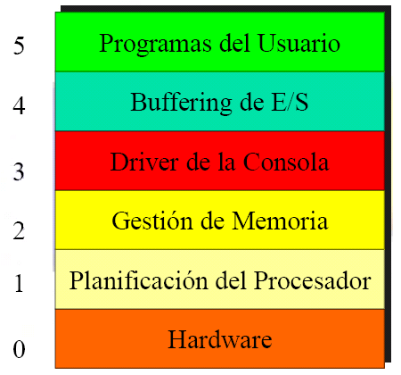
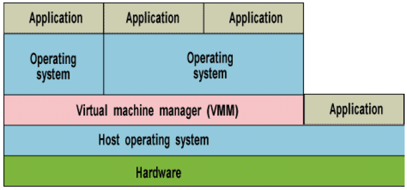
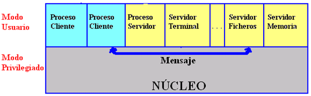
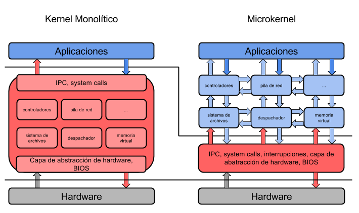
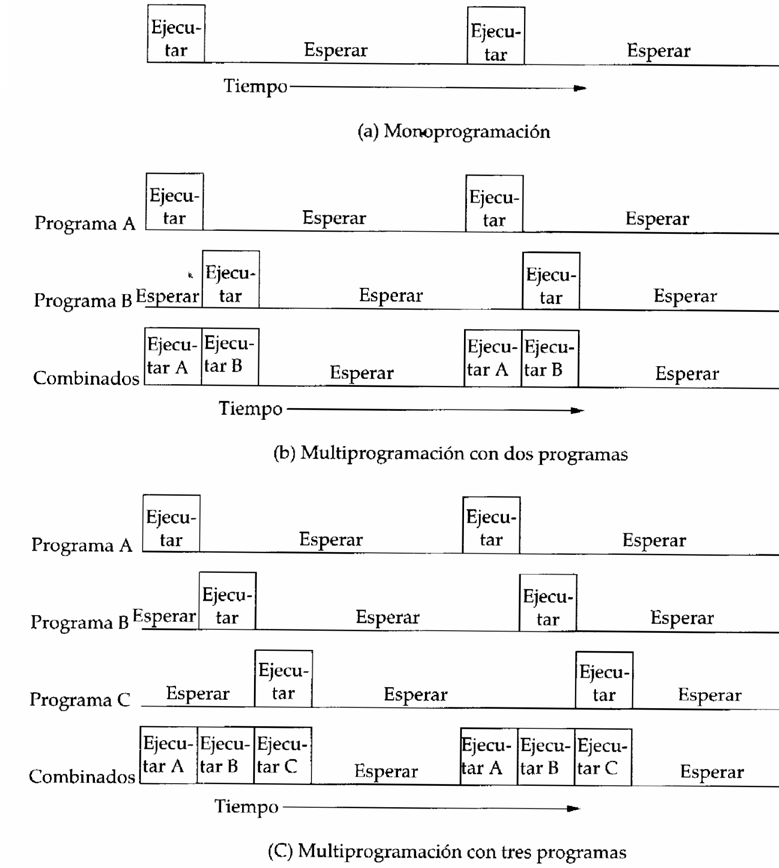

Arquitectura de los sistemas operativos
=======================================

Un sistema operativo es un programa grande y complejo que está compuesto por
una serie de componentes con funciones bien definidas. Cada sistema operativo
estructura estos componentes de distinta forma. Examinaremos cuatro
arquitecturas distintas que se han utilizado a lo largo de la historia, a fin
de tener una idea de la variedad de posibilidades que tienen los diseñadores
de sistemas operativos. Éstas no son de ninguna manera las únicas arquitecturas
posibles, pero nos darán una idea de algunos diseños que se han llevado a la
práctica. Los cuatro diseños son:

* Los sistemas monolíticos, 
* Los sistemas por capas (microkernel), 
* Las máquinas virtuales y 
* Los sistemas cliente-servidor.

Sistemas Monolíticos
--------------------

Este enfoque, que es por mucho la organización más común, bien podría
subtitularse «El Gran Desorden». La estructura consiste en que no hay
estructura. El sistema operativo se escribe como una colección de
módulos, cada uno de los cuales puede invocar a cualquiera de los otros
cuando necesita hacerlo. Cuando se usa esta técnica, cada parte del
sistema tiene una interfaz bien definida en términos de parámetros y
resultados, y cada uno está en libertad de invocar a cualquier otro, si este
último realiza algún cálculo útil que el primero necesita. Entre sus
características tenemos las siguientes:

- Permiten multiprogramación y soportan múltiples usuarios. 
- El sistema operativo es un conjunto de procedimientos que se agrupan en el núcleo. 
- El núcleo está protegido (modo dual). 
- Núcleo tiende a ser de gran tamaño, aumentando las posibilidades de falla (caídas del
  sistema). 
- Algunos servicios de más alto nivel pueden ser incorporados a nivel de procesos 
  del usuario.

Sistemas con Capas
------------------

Una generalización del enfoque anterior consiste en organizar el sistema operativo como
una jerarquía de capas, cada una construida sobre la que está abajo de ella.
El primer sistema que tuvo esta estructura fue el sistema THE construido en la
Technische Hogeschool Eindhoven de los Países Bajos por E. W. Dijkstra (1968)
y sus estudiantes. El sistema THE era un sencillo sistema por lotes para una
computadora holandesa, la Electrologica X8, que tenía 32K de palabras de 27 
bits (los bits eran costosos en esos tiempos). Podemos notar las siguientes
características de estos sistemas operativos:

- Permiten una mejor modularización y protección de las componentes del sistema.
- Comunicación entre capas se realiza mediante trampas (*traps* o interrupciones software).
- Comunicación entre capas introduce mucho costo en la operación (*overhead*).

   Figura 16 Estructura del S.O. por capas

Máquinas Virtuales
------------------

- Permite crear sobre una máquina varias máquinas virtuales. 
- Cada máquina virtual puede ejecutar un sistema operativo diferente. 
- Útil para ejecutar programas desarrollados para diferentes sistemas 
  operativos en una sola máquina. 
- Estructura normalmente pesada: Alto consumo de memoria y tiempo de
  procesador

   Figura 17 Máquinas Virtuales 

Sistemas Cliente/Servidor
-------------------------

Una  tendencia  en  los  sistemas  operativos  modernos  es  llevar  aún  más 
lejos  esta  idea  de trasladar  código  a  capas  superiores  y  quitarle  lo
más  que  se  pueda  al  sistema  operativo,  dejando un  kernel  mínimo.  El
enfoque  usual  consiste  en  implementar la  mayor  parte  de  las 
funciones del sistema operativo en procesos de usuario. Para solicitar un
servicio,  como  escribir en pantalla o leer el teclado, un proceso de usuario (ahora
llamado proceso cliente) envía la solicitud a un proceso servidor, el cual
realiza el trabajo y devuelve la respuesta.

   Figura 18 Sistemas cliente/servidor

Este  modelo se muestra en la Figura 18, lo único que  el  kernel  hace  es 
manejar la comunicación entre los clientes y los servidores.  Al dividir el
sistema  operativo en partes, cada una de las cuales sólo se encarga de una
faceta del sistema, como el servicio de archivos, de procesos, de terminales o
de memoria, cada parte puede ser pequeña y manejable. Además, dado que todos
los servidores se ejecutan como procesos en modo de usuario, y no en modo de
kernel, no tienen acceso directo al hardware. Por tanto, si se activa un error
en el servidor de archivos, es posible que el servicio de archivos se caiga,
pero normalmente esto no hará que se caiga toda la máquina.

   Figura 19 Comparación entre sistemas monolíticos y microkernel

Podemos ver en la figura anterior que en los sistemas por capas, como aquel
que tiene un microkernel, la estructura del sistema operativo es más simple,
es más pequeño y por lo tanto, es menos propenso a fallas. Además los sistemas
con microkernel son más fáciles de actualizar, ya que en los sistemas monolíticos,
si se nos ocurre un nuevo algoritmo o surge una nueva tecnología, debemos cambiar
todo el kernel del sistema operativo. En cambio, en los sistemas por capas,
estos cambios solo afectarán un módulo, que seguro está por fuera del kernel 
y no tenemos que cambiar el kernel para nada.

Otras Clasificaciones de los sistemas operativos
------------------------------------------------

Los sistemas operativos se pueden clasificar atendiendo a:

**Administración de Tareas:**
    
    * **Monotareas** o sistemas monoprogramados: que son aquellos que
      permiten ejecutar un sólo programa a la vez.
    * **Multitarea** o sistemas de multiprogramación: los que permiten
      ejecutar varias tareas o programas al mismo tiempo.

   Figura 20 Clasificación de los Sistemas Operativos de acuerdo a tareas

**Administración de Usuarios**:

    * **Monousuario**: aquellos que sólo permiten trabajar a un usuario
      tal como ocurre en los computadores personales.
    * **Multiusuario**: los que permiten que varios usuarios ejecuten sus
      programas a la vez y al mismo tiempo.

**Manejo de recursos o acceso a servicios**:

    * **Centralizados**: si permite utilizar los recursos de un solo computador
      y compartir esos recursos entre varios usuarios.
    * **Distribuidos**: si permite utilizar los recursos (*CPU*, *memoria*, *periféricos*,...)
      de más de un computador en red al mismo tiempo, sin que el usuario esté
      consciente de donde se encuentre estos recursos.