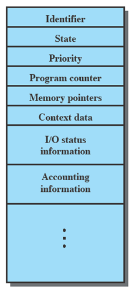
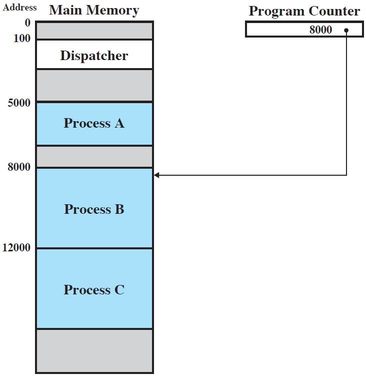
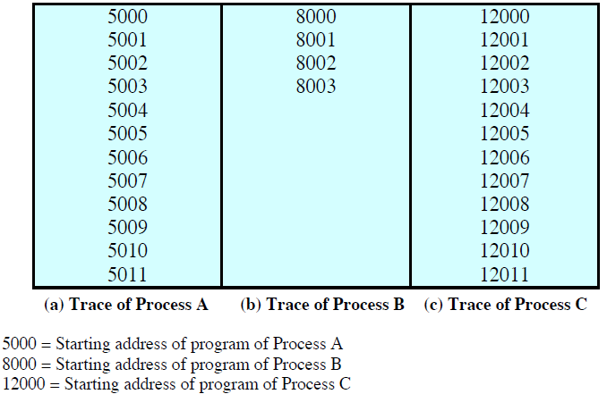
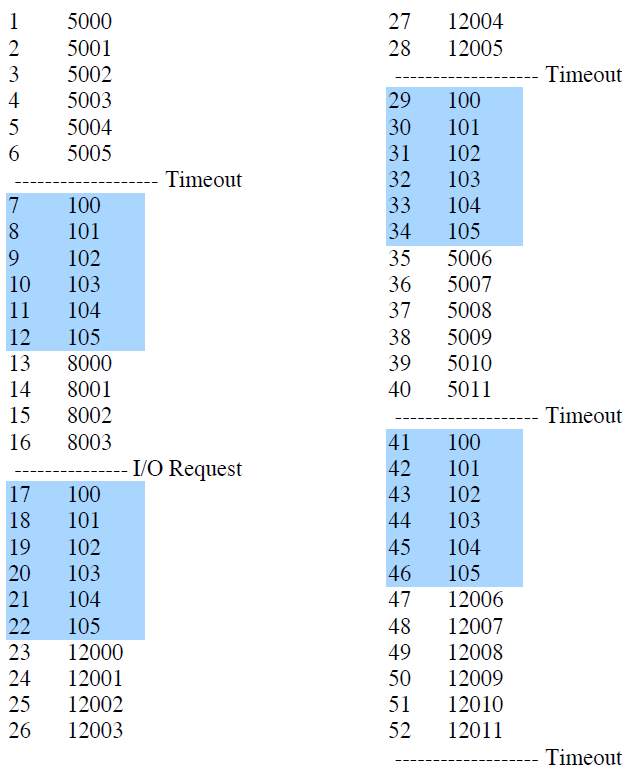
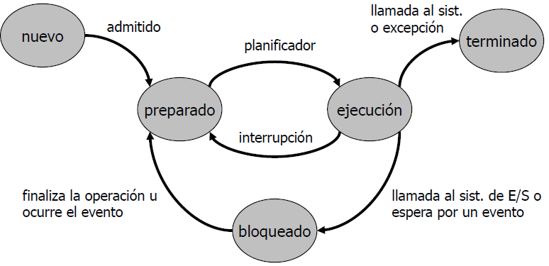
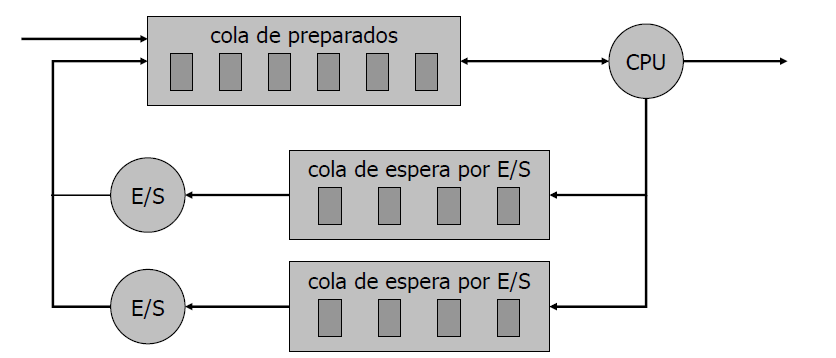

Gestión de Procesos
===================

En un sistema multiprogramado o multitarea, un proceso es la
imagen en memoria de un programa, junto con la información relacionada con
el estado de su ejecución. Para otros autores, un proceso no es más que un
programa en ejecución. Sin embargo, también encontramos definiciones como
que un proceso es una entidad que puede ser asignada a un procesador y
ejecutada en él. 

Entonces podemos indicar que un *programa* es una entidad pasiva, estática, una lista 
de instrucciones; mientras que un *proceso* es una entidad activa, que –empleando 
al programa– define la actuación que tendrá el sistema.

El Sistema Operativo es el controlador de los sucesos que se producen en un
sistema informático. Es él quien planifica y expide los procesos para su
ejecución en el procesador, el que asigna los recursos a los procesos y el que
responde a las solicitudes de servicios básicos realizadas por los programas
de usuario. Esencialmente, se puede imaginar al Sistema Operativo como una
entidad que administra el uso que hacen los procesos de los recursos el
sistema. Adicionalmente, el sistema operativo debe proporcionar las siguientes
funcionalidades para el control de los procesos:

* Intercalar la ejecucion de muchos procesos que permita maximizar la
  utilización del procesador mientras que proporciona un tiempo de
  respuesta razonable.
* Soportar la comunicación entre procesos y permitirle a los usuarios la
  creación y finalización de tales procesos.  

Información asociada a un proceso
---------------------------------

El SO agrupa toda la información que necesita conocer respecto a un proceso
particular en una estructura de datos denominada descriptor de proceso o
bloque de control de proceso (BCP, en inglés PCB = *Process Control Block*). 
Cada vez que se crea un proceso, el SO crea uno de estos bloques para que
sirva como descripción en tiempo de ejecución durante toda la vida del
proceso. Esta es la manera en que los sitemas operativos conocen lo qué hacen y
los recursos que tiene un proceso. 

De forma definitiva, encontramos que además del BCP, en la memoria del computador,
el sistema operacional debe mantener también los siguiente elementos:

* **Datos del Usuario**: La parte modificable del espacio de usuario. Puede
  guardar datos del programa, una zona para una pila del usuario y programas
  que pueden modificarse. Aquí se almacenan las variables del programa.
* **Programa del Usuario**: El código del programa que se ejecuta.
* **Pila del Sistema**: Cada proceso tiene una o más pilas (el último que entra 
  es el primero en salir) asociadas a él. Una pila se utiliza para almacenar los 
  parámetros de las funciones, las variables locales y las direcciones de retorno.

El Bloque de control de procesos (BCP o PCB)
^^^^^^^^^^^^^^^^^^^^^^^^^^^^^^^^^^^^^^^^^^^^

Ya sabemos que esta estructura de datos se almacenan los atributos de un proceso, 
es decir, la información asociada a un proceso. El *PCB* incluye campos como:

Identificadores
    Los identificadores numéricos que se pueden guardar en el bloque de control 
    de proceso incluyen:
    * Identificador de este proceso.
    * Identificador del proceso que creó a este proceso (el proceso padre)
    * Identificador del usuario.

Estado del proceso 
    El estado actual del proceso. Este puede ser: nuevo, listo, en ejecución, 
    en espera, detenido, etc.

Contador de programa 
   El contador indica la dirección de la siguiente instrucción que se ejecutará 
   para este proceso.

Registros del CPU 
    El número y el tipo de los registros varía dependiendo de la
    arquitectura del computador. Los registros incluyen acumuladores, registros
    índice, punteros de pila y registros de propósito general, así como cualquier
    información adicional que haya. Junto con el contador de
    programa, esta información de estado se debe guardar cuando ocurre una
    interrupción, para que el proceso pueda continuar correctamente después.

Información de planificación (*scheduling*)  de la CPU
    Esta información incluye la prioridad del proceso, la cola en
    que está agendado, y demás información que puede ayudar al sistema operativo a
    planificar los procesos; se profundizará el tema más adelante. 

Información de administración de memoria  
    Esta información puede incluir datos tales como el valor de los registros de
    base y límite, las tablas de páginas o las tablas de segmentos, dependiendo
    del sistema de memoria empleado por el sistema operativo.

Información de contabilidad
    Información de la utilización de recursos que ha tenido este proceso. Puede
    incluir el tiempo total empleado y otros , uso acumulado de memoria y
    dispositivos, etc. 

Información de estado de E/S 
    Listado de dispositivos y archivos asignados que el proceso tiene abiertos en 
    un momento dado.

   Figura 22 El Bloque del Control de Proceso

Jerarquía de Procesos
^^^^^^^^^^^^^^^^^^^^^

La secuencia de creación de procesos genera un **árbol de procesos**. Para
referirse a las relaciones entre los procesos de la jerarquía se emplean los
términos de padre, hermano o abuelo. Cuando el proceso A solicita al sistema
operativo que cree el proceso B, se dice que A es padre de B y que B es hijo
de A. Bajo esta óptica, la jerarquía de procesos puede considerarse como un
árbol genealógico. Algunos sistemas operativos, como Unix, mantienen de forma
explícita esta estructura jerárquica de procesos:  un proceso sabe quién es su
padre, mientras que otros sistemas operativos como el Windows no la
mantienen.

Planificador y Activador
^^^^^^^^^^^^^^^^^^^^^^^^

El planificador (*scheduler*) forma parte del núcleo del sistema operativo.
Entra en ejecución cada vez que se activa el sistema operativo y su misión es
seleccionar el proceso que se ha de ejecutar a continuación. El activador
(*dispatcher*) también forma parte del sistema operativo y su función es poner
en ejecución el proceso seleccionado por el planificador.

Cambio de Contexto
^^^^^^^^^^^^^^^^^^

La activación del sistema operativo se realiza mediante el mecanismo
de las interrupciones. Cuando se produce una interrupción se realizan 
las dos operaciones siguientes:

* Se salva el estado del procesador en el correspondiente PCB.
* Se pasa a ejecutar la rutina de tratamiento de interrupción del sistema operativo.

Llamaremos **cambio de contexto** (*context switch*) al conjunto de estas operaciones. 
El tiempo de cambio de contexto es exclusivamente un gasto extra (*overhead*), porque el
sistema no realiza trabajo útil durante la conmutación. Por ser un cuello de botella tan
importante para el desempeño del sistema operativo se están empleando estructuras
nuevas (hilos) para evitarla hasta donde sea posible.

Podemos caracterizar el comportamiento de un proceso individual, listando la secuencia
de instrucciones que ejecuta ese proceso. Tal listado o historia de instrucciones la
denominamos la **traza** del proceso. Si queremos caracterizar el comportamiento del
procesador, podemos hacerlo mostrando las trazas de los varios procesos que intercalan
su ejecución sobre el procesador.

Consideremos un ejemplo. La figura a continaución muestra en un instante dado la
conformación de la memoria de un computador con tres procesos ejecutándose al
mismo tiempo.

   Figura 23 Ejecución de procesos en un momento dado

Ahora, la figura a continuación muestra las trazas de cada una de los procesos anteriores.
Cada número indica la posición en memoria donde se encuentra cada de una de las operaciones
que hacen parte de los programas de cada proceso.

   Figura 24 Trazas de los procesos

Ahora veamos estas trazas desde el punto de vista del procesador. La Figura 25 muestra
las trazas intercaladas de los tres procesos para las primeras 52 ciclos de reloj del
procesador. En esta figura, las áreas sombreadas representan el código ejecutado por
el programa *despachador*.

   Figura 25 Trazas combinadas de los procesos

Estados de un Proceso
^^^^^^^^^^^^^^^^^^^^^

El principal trabajo del procesador es ejecutar las instrucciones de máquina
que se encuentran en memoria principal. Estas instrucciones se encuentran en
forma de programas. Para que un programa pueda ser ejecutado, el Sistema
Operativo crea un nuevo proceso y el procesador ejecuta una tras otra las
instrucciones del mismo. En un entorno de multiprogramación, el procesador
intercalará la ejecución de instrucciones de varios programas que se
encuentran en memoria. El Sistema Operativo es el responsable de determinar
las pautas de intercalado y asignación de recursos a cada proceso.

Un proceso, a lo largo de su vida, alterna entre diferentes estados de ejecución. 
Estos son:

* **Nuevo** Se solicitó al sistema operativo la creación de un proceso, y sus recursos y 
  estructuras están siendo creadas.
* **Preparado** Está listo para iniciar o continuar su ejecución pero el sistema no le 
  ha asignado el procesador.
* **En ejecución** El proceso está siendo ejecutado en este momento. Sus instrucciones 
  están siendo procesadas en algún procesador.
* **Bloqueado** En espera de algún evento para poder continuar su ejecución (aun si hubiera
  un procesador disponible, no podría avanzar).
* **Zombie** El proceso ha finalizado su ejecución, pero el sistema operativo debe realizar
  ciertas operaciones de limpieza para poder eliminarlo de la lista.
* **Terminado** El proceso terminó de ejecutarse; sus estructuras están a la espera de ser
  limpiadas por el sistema operativo.

   Figura 26 Estados de un proceso

Cola de Procesos
^^^^^^^^^^^^^^^^

El Sistema Operativo mantiene una cola de BCP para cada uno de estos estados del sistema. 
Cada proceso pertenece a una únicacola. Así, posee una cola de los procesos que están en
el estado preparado, una cola de los procesos en el estado bloqueado o suspendido y en el
caso de sistemas multiprocesador, una cola de los procesos activos o en ejecución. Si el
sistema es uniprocesador, la lista de los procesos activos se reduce a una sola entrada.

   Figura 27 Colas de Procesos

