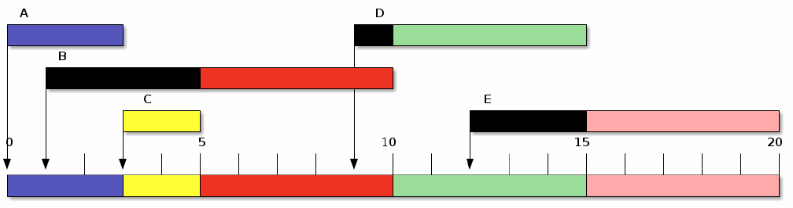
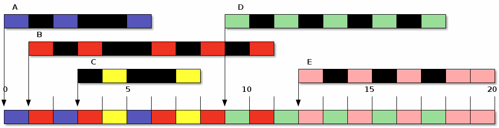

El Planificador de Procesos
===========================

La *planificación de procesos* se refiere a cómo determina el sistema operativo
al orden en que irá cediendo el uso del procesador a los procesos que lo vayan
solicitando, y a las políticas que empleará para que el uso que den a dicho
tiempo no sea excesivo respecto al uso esperado del sistema. En muchos sistemas, 
la actividad de planificación se divide en tres funciones independientes: planificación 
a largo, medio y corto plazo.

Níveles de Planificación
------------------------

**Planificador de Largo Plazo (PLP)**
    El PLP determina qué trabajos se admiten en el sistema para su procesamiento, 
    es decir, su tarea consiste en decidir qué procesos seran los siguientes en 
    ser iniciados.

**Planificador de Mediano Plazo (PMP)**
    Decide cuáles procesos es conveniente bloquear en determinado
    momento, sea por escasez/saturación de algún recurso (como la
    memoria primaria) o porque están realizando alguna solicitud que no
    puede satisfacerse momentáneamente; se encarga de tomar decisiones
    respecto a los procesos conforme entran y salen del estado de bloqueado
    (esto es, típicamente, están a la espera de algún evento externo o de la
    finalización de transferencia de datos con algun dispositivo.

**Planificador de Corto Plazo (PCP)**
    Se encarga de decidir qué proceso de la cola de preparados pasa a ejecutarse.
    Es el que se ejecuta con más frecuencia por lo que su tiempo de decisión debe ser bajo.
    Se ejecuta cuando un proceso que está ejecutándose es interrumpido, por ejemplo, para realizar una operación de E/S o que exista la posibilidad de retirar el proceso actual en favor de otro proceso de prioridad mayor.

    El *planificador a corto plazo* es también frecuentemente denominado *despachador*
    (dispatcher).

   Figura 28 Niveles de planificación

Algoritmos de Planificación
---------------------------

Se han propuesto un número elevado de algoritmos de planificación cuya adecuación a un
sistema completo depende del tipo de planificador que se desee y de los objetivos que se
persigan. Por ello, en los sistemas actuales es posible encontrar una gran variedad
de algoritmos. Nos limitaremos a exponer las características generales de los más
importantes, prestando atención a los que se utilizan en el PCP.

Criterios para la planificación
^^^^^^^^^^^^^^^^^^^^^^^^^^^^^^^

Los algoritmos tienen distintas propiedades según los criterios en los que se basen para
su construcción, lo cual se refleja en que un tipo de procesos se puede ver favorecido
frente a otro en la disputa por el procesador. Así, antes de realizar la elección de un
algoritmo se deben considerar las propiedades de éstos frente al criterio de diseño
elegido. Algunos de estos criterios son:

a) **Utilización de CPU:** porcentaje de tiempo que la CPU está ocupada por algún proceso
   diferente al despachador.
b) **Tiempo de retorno** (*turnaround*): tiempo transcurrido entre la llegada de un 
   proceso y su finalización.
c) **Tiempo de espera:** tiempo que un proceso permanece en la cola de preparados.
d) **Tiempo de respuesta:** tiempo que un proceso bloqueado tarda en entrar en CPU, 
   desde que ocurre el evento que lo bloquea.
e) **Rendimiento** (*throughput*): es una medida del número de procesos completados 
   por unidad de tiempo. Por ejemplo, 10 procesos por segundo.

El criterio de selección de un algoritmo se suele basar en la maximización o minimización
de una función de los parámetros anteriores. Por ejemplo, maximizar el rendimiento y
minimizar el tiempo de espera, o bien, minimizar la varianza del tiempo de respuesta.

Planificación por expropiación
^^^^^^^^^^^^^^^^^^^^^^^^^^^^^^

Existen algorimos denominados **expropiativos**, donde el proceso que se está ejecutando
puede ser interrumpido y pasado al estado de *preparado* por parte del SO. La decisión de
adueñarse de la CPU puede llevarse a cabo cuando llega un nuevo proceso o cuando se produce
una interrupción o periódicamente. Sirven para implementar sistemas de tiempo compartido
y tiempo real. Es el más utilizado hoy en día en sistemas operativos como Unix, Linux, 
Windows 10, Mac OS X, etc.

En los algorimots con estrategia de **no expropiación**, el proceso que está activo
permanece con el procesador hasta que termine y devuelva el control al SO. Este tipo de
estrategia suele hacer un uso menos frecuente del PCP que la estrategia con expropiación,
lo que implica una mayor dedicación a los procesos de los usuarios frente a los del sistema.
Obviamente esta política de planificación posee problemas de acaparamiento injusto de la
CPU. Fue utilizado por sistemas operativos de antaño como MS-DOS, Windows 3.11, o las
primeras versiones del sistema operativo de los Apple Macintosh.

También se llaman a estas estrategias **expulsivas** o **apropiativas**.

Planificación FCFS: primero en llegar primero en ser servido
------------------------------------------------------------

El esquema más simple de planificación es el *primero llegado, primero servido
(first come, first serve*, FCFS). Este es un mecanismo cooperativo, con la mínima
lógica posible: cada proceso se ejecuta en el orden en que fue llegando, y hasta
que *suelta el control*. El despachador es muy simple, básicamente una cola FIFO.
El método es no expropiativo. Rara vez se utiliza en la actualidad, pero se emplea
dentro de otros esquemas.

**Ejemplo:** la siguiente tabla muestra la información de 5 procesos que se ejecutan en 
un sistema operativo que utiliza una política de planificación FCFS. Podemos ver en
la tabla el tiempo de llegada que posee el proceso, asi como la duración de cada uno
de ellos.

=======   =================   ========
Proceso   Tiempo de llegada   Duración
=======   =================   ========
A         0                   3
B         1                   5
C         3                   2
D         9                   5
E         12                  5
=======   =================   ========

El siguiente diagrama (llamado también *Diagrama de Gantt*), presenta la utilización
del procesador y como el despachador asigna a cada uno de estos procesos al procesador.

   Figura 29 Planificación por FCFS

Podemos ver en el diagrama anterior, que el proceso *A* inicia desde su tiempo de llegada
a la cola de preparados (*t=0*) y cede la CPU al proceso *B* en el tiempo 3, cuando finaliza.

En la siguiente tabla podemos ver el cálculo del tiempo de espera (*E*) y del tiempo de
retorno (*R*) para cada uno de estos procesos si aplicamos el algoritmo de planificación
FCFS.

========  ======    ====    ====  ====
Proceso   Inicio    Fin     E     R
========  ======    ====    ====  ====
A         0         3       0     3
B         3         8       2     7
C         8         10      5     7
D         10        15      1     6
E         15        21      3     9
--------  ------    ----    ----  ----
Promedio                    2.2   6.4
========  ======    ====    ====  ====

Planificación SJF=*Shortest Job First*, el proceso más corto primero
--------------------------------------------------------------------

Cuando no se tiene la posibilidad de implementar multitarea apropiativa,
pero se requiere de un algoritmo más justo, contando con información por anticipado
acerca del tiempo que duran los procesos , puede elegirse el más corto de los presentes,
o sea, el de menos duración de la cola de preparados.

Lo interesante de esta política de planificación es que minimiza el tiempo de
espera promedio. Como era de esperarse, SJF favorece a los procesos cortos. Sin embargo,
un proceso largo puede esperar mucho tiempo antes de ser atendido,  un proceso más 
largo que el promedio está predispuesto a sufrir *inanición*.

Usando el ejemplo presentado con la política FCFS, vamos a tener la siguiente
planificación de procesos en un diagrama GANTT:

   Figura 30 Planificación por SJF

En la siguiente tabla podemos ver el cálculo del tiempo de espera (*E*) y del tiempo de
retorno (*R*) para cada uno de estos procesos si aplicamos el algoritmo de planificación
SJF.

========  ======    ====    ====  ====
Proceso   Inicio    Fin     E     R
========  ======    ====    ====  ====
A         0         3       0     3
B         5         10      4     9
C         3         5       0     2
D         10        15      1     6
E         15        21      3     9
--------  ------    ----    ----  ----
Promedio                    1.6   5.8
========  ======    ====    ====  ====   

Además del riesgo de **inanición** de los procesos de larga duración 
que sufre esta política de planificación, hay que recordar que esta política
no es implementable en la vida real, aunque se puede *estimar* las duraciones
de los procesos, según su historia reciente.

Existe una versión expropiativa de este algoritmo, denominada política
**SRTF** = *Shortest Remaining Time First*. Bajo este esquema, el proceso que
está en la CPU será desalojado si llega a la cola de preparados un proceso
con una duración más corta o menor.

Planificación por prioridades
-----------------------------

Es normal en los sitemas operativos modernos asignarle un nivel de importancia
o *prioridad* numérica a los procesos. La política basa en prioridades se basa
en dejar entrar a la CPU a aquel proceso que tiene la mayor prioridad. Esta
política puede ser expropiativa o no. Hay que tener en cuenta que aunque es el
sistema operativo el que normalmente define la prioridad del proceso, también
existe la posibilidad que sea el usuario quien específique esta prioridad. Podemos
decir que la política SJF es un caso especial de prioridades, donde tomamos como
prioridad del proceso la duración estimada del proceso.

Igual que con SJF, en esta política de planificación también sufrimos riesgos de
**inanición** de los procesos con menor prioridad. Una solución que encontramos
en la literatura consiste en el **envejecimiento (*aging*)** del proceso. Esta
solución consiste en aumentar la prioridad de los procesos de manera progresiva a 
medida que esperan mucho en la cola de preparados.

Planificación por Turno Rotatorio (*Round Robin*)
-------------------------------------------------

El esquema por turnos rotatorios busca dar una relación de respuesta buena,
tanto para procesos largos como para los cortos. La principal diferencia entre
los turnos y FCFS es que en este caso sí emplea multitarea apropiativa: cada
proceso que esté en la lista de procesos listos puede ejecutarse por un sólo
*quantum (q)*. Si un proceso no ha terminado de ejecutar al final de su
*quantum*, será interrumpido y puesto al final de la cola de procesos
preparados, para que espere a su turno nuevamente. Los procesos que sean
despertados por los planificadores a mediano o largo plazos se agregarán
también al final de esta cola. 

Con la misma tabla de procesos presentada en los casos anteriores y utilizando
un *quantum=1*, obtendremos el siguiente diagrama de GANTT:

   Figura 31 Planificación por RR, Turnos Rotatorios

En la siguiente tabla podemos ver el cálculo del tiempo de espera (*E*) y del tiempo de
retorno (*R*) para cada uno de estos procesos si aplicamos el algoritmo de planificación
RR.

========  ======    ====    ====  ====
Proceso   Inicio    Fin     E     R
========  ======    ====    ====  ====
A         0         6       3     6
B         1         11      4     10
C         4         8       3     5
D         9         18      4     9
E         12        21      3     9
--------  ------    ----    ----  ----
Promedio                    3.4   7.8
========  ======    ====    ====  ====   

Los turnos puede ser ajustada modificando la duración de *q*. Conforme se
incrementa *q*, los turnos tienden a convertirse en FCFS. Si *q* es muy grande, 
los procesos terminan sus tiempo de CPU antes de que termine su tiempo. Pero
si *q* es muy pequeño, se tiende a un sistema en el que cada proceso dispone de 
un procesador a 1/N de la velocidad del procesador real (procesador compartido).
Finalmente si *q* se vuelve muy pequeño, ocurren más cambios de contexto y baja el 
rendimiento (*q* debería ser mucho mayor que el tiempo que dura un cambio de
contexto).

Varios autores han propuestos modificaciones al algoritmo *RR*. Una de ellas consiste
en tener un *quantum (q)* de duración variable, en función de la carga del sistema o
de la prioridad del proceso que entre a la CPU. Por ejemplo, en el sistema operativo Linux,
cada proceso que entra a la CPU recibe una *q* proporcional al tiempo que el proceso ha
estado en espera y al número de procesos en el sistema.
