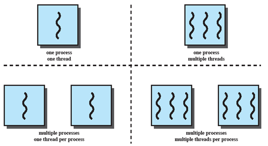

Procesos e Hilos
================

¿Qué es un hilo?
----------------

Un *Hilo*, algunas veces llamado un proceso liviano o en inglés *lightweight process* (**LWP**), 
es una unidad básica de utilización de la CPU. Los hilos se utilizan en sistemas multitareas junto
con los procesos para tener la capacidad de realizar muchas tareas al mismo tiempo en un solo
computador. 

Contrario a un proceso pesado, la información que guarda el sistema operativo es mucho menor. Esta
información incluye:

* Un identificador del hilo (*Thread ID*)
* El contador del programa
* Los registros de la CPU
* La pila del programa

Conceptos de hilos (Thread)
---------------------------

Los hilos comparten, con otros hilos del mismo proceso, la sección de código, la sección de datos,
y otros recursos del sistema operativo, tales como los archivos abiertos y las señales recibidas
del hardware.

Los procesos tradicionales (o pesados) solo poseían un solo hilo de control, pero si estos procesos
logran tener muchos hilos de contro, pueden hacer más que una sola tarea a la vez.

   Figura 32 Aplicaciones monohilos y mutihilos

Ejemplo:
    Un procesador de palabras, como *Microsoft Word* puede utilziar un hilo para el despliegue del
    documento en la pantalla, otro hilo para leer desde el teclado lo que el usuario ingresa, y otro
    tercer hilo para realizar el chequeo de sintaxis y de gramática a medida que el usuario escribe
    en el documento.

Si nos basado en su forma de implementación, tenemos históricamente, dos tipos de hilos:

* Hilos a nivel de usuario
* Hilos a nivel de kernel

Hilos a nivel de usuario
^^^^^^^^^^^^^^^^^^^^^^^^

Este tipo de hilos se usan cuando el kernel no soporta el concepto de hilos, y son implementados por
una biblioteca de programación especializada en hilos al nivel de usuario.

Esta bibliotecas proveen soporte para la creación de hilos, el manejo de la planeación de los hilos y 
la gestión de los mismos sin la participación del kernel.

Ya que el kernel no tiene ni idea de la existencia de estos hilos a nivel de usuario, todo el control
de los hilos corre por cuenta del usuario y todo sucede sin la intervención del sistema operativo.

Hilos a nivel de kernel
^^^^^^^^^^^^^^^^^^^^^^^

Esto ocurre cuando los hilos son soportados e implementados directamente en el kernel del sistema
operativo. En las últimas versiones de los sistemas operativos, este es el esquema preferido ya que
le permite al kernel un mejor control de los hilos y ofrecerle al usuario esquemas de comunicación
y seguridad.

Bajo este esquema, el kernel desarrolla las tareas de **creación de hilos**, planificación de los mismos
y gestión en el espacio del núcleo del sistema operativo.

Ya que la gestión de los hilos es hecha por el sistema operativo, la creación y gestión de los hilos
suele ser más lentas que en los hilos a nivel de usuario. Sin embargo, y precisamente porque es el
sistema operativo quien controla a los hilos, cuando estos realizan alguna tarea bloqueante (leer 
desde el teclado o imprimir en la impresora), el kernel puede «darle la mano» a otro hilo del mismo
proceso sin que el proceso entero se bloquee. Adicionalmente, en ambiente multiprocesador, el
kernel puede colocar hilos del mismo proceso en procesadores diferentes, dando un verdadero paralelismo
para un solo proceso.

Diferencia entre proceso e hilo
-------------------------------

Hay que tener en cuenta que un hilo se considera un proceso liviano, ya que guarda menos información 
que toda aquella que se guarda para un proceso en el bloque de control de proceso. Pero adicionalmente
a esto, hay que tener en cuenta que un hilo *vive* dentro de un proceso, es totalmente dependiente 
de él y cuando acaba el proceso, acaban todos los hilos que fueron creados dentro de él. Finalmente,
tenemos que tener claro que un proceso es un programa en ejecución, mientras que un hilo es un
elemento interno del programa (sea una función o un método) en ejecución. 

Pero también podemos encontrar similaridades entre procesos e hilos. Por ejemplo:

* Los hilos comparte CPU tal como lo hacen los procesos.
* Los hilos pueden crear otros hilos (que llamaremos *hilos hijos*) y se bloquean mientras esperan
  que una llamada al sistema se complete. Igual sucedía con los procesos.
* Los hilos, igual que los procesos, están en uno de muchos estados: en ejecución, bloqueados, listos
  o terminado.

En los sistemas operativos modernos, como Linux por ejemplo, se denomina al hilo como la unidad básica
de ejecución de los programas, y es a ellos a los que el despachador les da la mano al momento de 
realizar la tarea de planificación de la CPU. Al proceso se le dejó ahora la tarea de ser la unidad
de propiedad de los recursos. Algo así como la bodega compartida por los hilos, donde se almacenan
los diferentes recursos a los que los hilos tienen acceso. Recursos como archivos, dispositivos,
memoria, etc.

Multihilo
---------

Se dice que un sistema operativo es **Multihilo** (*multithreading*) si tiene la habilidad de soportar
múltiples hilos dentro de un solo proceso.

   Figura 32 Tipos de sistemas operativos

A través de la historia, los tipos de sistemas operativos han evolucionado en cuanto al manejo de hilos
y procesos. MS-DOS fue un sistema operativo mono usuario, mono proceso y mono hilo. Igualmente, las
primeras versiones de UNIX, a pesar de ser multiusuario y multiproceso, eran mono hilo por proceso.

El ambiente de ejecución de Java incluye esquema mono proceso pero multihilo. Sin embargo, los sistemas
operativos modernos, como Mac OS/X, Linux o Windows, ya soportan un funcionamiento multiusuario, multiproceso
y, obviamente, multihilo.

IPC = Inter-process Communication
---------------------------------

**IPC** o **I**nter-**P**rocess **C**ommunication (Comunicación entre procesos) son una serie de 
utilidades del sistema operativo para proporcionar mecanismos para que los procesos cooperen entre
si a través de la comuniciacón entre ellos.

IPC permite no solamente que los procesos se comuniquen entre si, sino también permite que los 
procesos sincronicen sus acciones sin necesidad de estar en el mismo espacio de direcciones. 

IPC es muy útil si nos encontramos en ambientes distribuidos, ya que la comunicación de procesos
logra que los procesos compartan información estando en computadores diferentes unidos por una red.
Por ejemplo, un programa de chat o un juego en línea.

Uno de los mecanismos más utilizados para la comunicación entre procesos es el «paso de mensajes».
En este esquema de comunicación, los procesos envían y reciben datos y variables de un proceso a otro.
Bajo esta arquitectura, el sistema operativo ofrece al usuario dos llamadas al sistema para lograr
la comunicación:

* **send(message)**
* **receive(message)**

