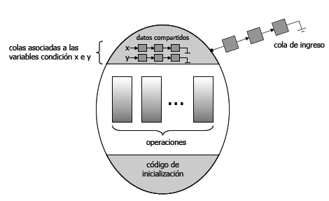
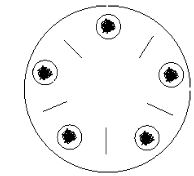
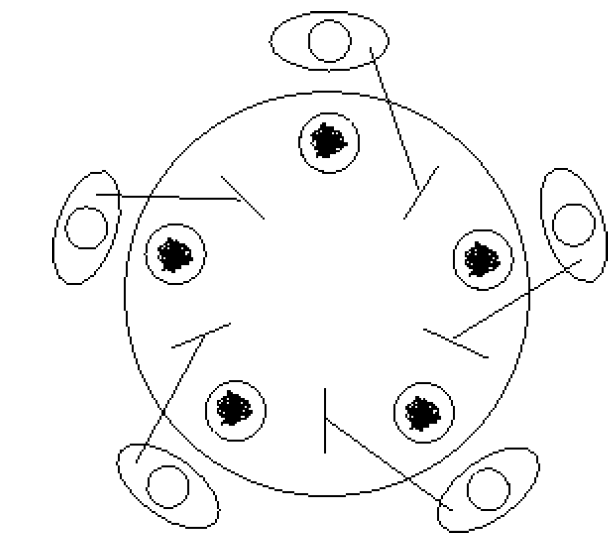

Sincronización de Procesos
==========================

Se denomina **procesos cooperantes** a aquelos procesos que pueden afectar
o verse afectado por otros procesos que se están ejecutando en el sistema.

Los procesos cooperantes puede compartir, ya sea directamente o a través
de archivos, todo el código y los datos de los programas. Para los hilos,
compartir un datos y variables, es algo normal. Pero cuando varios hilos
tienen acceso concurrente a estos datos puede resultar en inconsistencia
de datos.

Hablamos entonces de **sincronización de procesos**, que trata del mecanismo
que permite asegurar la ejecución ordenada de procesos cooperantes que
comparten los mismos datos, de forma tal que la consistencia de estos datos
se mantiene.

¿Cómo se lleva a cabo la sincronización de procesos?
----------------------------------------------------

Cuando tenemos un conjunto de procesos cooperantes que tienen acceso a datos
compartidos, el sistema operativo tiene que proporcionar mecanismos de
exclusión mutua a esos datos.

Una solución es através del concepto de **sección crítica** de código. Esto es,
la porción de código de un programa de computador en la que se accede a un recurso 
compartido (estructura de datos o dispositivo) que no debe ser accedido por más de un
proceso o hilo en ejecución. La sección crítica por lo general termina en un tiempo
determinado y el hilo, proceso o tarea sólo tendrá que esperar un período determinado 
de tiempo para entrar.

Problema de la sección crítica
^^^^^^^^^^^^^^^^^^^^^^^^^^^^^^

Supongamos que tenemos :math:`n` procesos ejecutándose al mismo tiempo en el mismo
procesador :math:`[P_1, P_2, \cdots, P_n]`. Cada procesos tiene un segmento de código,
que llamaremos **sección crítica**, en la cual los procesos cambian variables
comunes, actualizan una base de datos, imprimen en la pantalla, y así sucesivamente.

Hay que tener en cuenta que una de las característica más importantes del sistema es
que, cuando un proceso está ejecutando en su sección crítica, ningún otro procesos
tiene el permiso de ejecutar código en su sección crítica.

Es por eso que la ejecución de las secciones críticas por los procesos es
**mutuamente exclusiva** en el tiempo. Entonces, el problema de la sección
crítica consiste en diseñar un protocolo que los procesos puedan usar para
cooperar en el uso de datos compartidos.

En estos protocolos, cada proceso debe solicitarle permiso al sistema operativo
para entrar a su sección crítica. Y una vez finalice la ejecución de la sección
crítica, el proceso debe avisarle al sistema operativo que va a salir de la
sección crítica. En forma general, la estrucutra del código de estos procesos
cooperantes :math:`P_i` sería la siguiente:

.. code-block:: python
   :emphasize-lines: 2, 4
   
   while True:
       entrar_seccion_critica()
       seccion_critica()
       salir_seccion_critica()

       resto_del_proceso()

Soluciones al problema de la sección crítica
^^^^^^^^^^^^^^^^^^^^^^^^^^^^^^^^^^^^^^^^^^^^

Una solución al problema de la sección crítica debe satisfacer los siguientes
tres requerimientos

Exclusión Mutua:
    Si un proceso :math:`P_i` está ejecutando su sección crítica, entonces ninguno
    de los otros procesos puede estar ejecutando sus secciones críticas.

Progreso:
    Si ningún proceso está ejecutando su sección crítica, y algún proceso desea 
    entrar a la sección crítica, entonces solo estos procesos que no están ejecutando
    las secciones críticas pueden participar en la decisión de quien entrará a
    continuación a su sección crítica, y la selección no puede ser pospuesta 
    indefinidamente.

Espera limitada:
    Existe un límite en el número de veces que otros procesos tienen permiso de
    entrar a sus secciones críticas después que un proceso ha hecho un requerimiento
    de entrar a la sección crítica y antes que el permiso sea otorgado por el
    sistema operativo.

Solución con dos procesos
^^^^^^^^^^^^^^^^^^^^^^^^^

Supongamos que tenemos dos procesos :math:`P_0` y  :math:`P_1`, de la siguiente
manera podemos lograr que ambos procesos trabajen cooperativamente usando exclusión
mutua:

**Algoritmo 1**

Supongamos que los procesos comparten una variable entera en común llamada ``turno``
, que puede ser inicializada en 0 o en 1. Entonces se da que si ``turno == i``,
entonces el proceso :math:`P_i` tiene permiso de entrar y ejecutar su **sección
crítica**.

La estructura del proceso se muestra a continuación:

.. code-block:: python

   while True:
       while turno == i:
           pass
       
       seccion_critica()

       turno = j
       resto_del_proceso()

Esta solución asegura que únicamente un proceso a la vez puede estar en su
sección crítica. Sin embargo, esta solución no satisface el requerimiento de
progreso, ya que requiere la ejecución alternativa de los procesos en la
sección crítica. Por ejemplo, si ``turno == 0`` y :math:`P_1` está listo
para entrar a su sección crítica, no puede hacerlo hasta que :math:`P_0`
use la sección crítica, aunque esté lejos de entrar en ella.

**Algoritmo 2**

El problema con el algoritmo 1 es que no retiene suficiente información acerca
del estado de cada proceso; el algoritmo solo recuerda el proceso que va a entrar
a la sección crítica. Para remediar este problema, podemos reemplazar la variable
``turno`` por un vector de variables booleanas que denominaremos ``banderas``. Todas
las banderas se inicializan en ``False``. Si ocurre que ``banderas[i]`` es
verdadera o ``True``, indica que :math:`P_i` está listo para entrar a la 
sección crítica.

.. code-block:: python

   while True:
       banderas[i] = True
       while banderas[j]:
           pass
        seccion_critica()
        baderas[i] = False
        resto_del_proceso()

En este algorimo, lo primero que hace el proceso :math:`P_i` es colocar el valor
de la variable ``banderas[i]`` en True, para indicar que está listo para entrar
en su sección crítica. Luego, proceso verifica que otro proceso :math:`P_j`
no se encuentra ya en su sección crítica. Si el proceso encontró que ya alguien
está en su sección crítica, espera a que finalice antes de solicitar el acceso 
a la misma.

Cuando ya termina la ejecución de la sección crítica, el proceso coloca un false
en las ``banderas[i]``, de forma tal que si había otro proceso esperando entrar
a su sección crítica, pueda hacerlo ahora.

En esta solución, el requerimiento de la exclusión muta se satisface sin problema.
Infortunadamente, el requerimiento de **progreso** no se tiene.

Semáforos
^^^^^^^^^

Un semáforo es una herramienta de sincronización. Es una de las primitivas de
sincronización más antiguas de la historia de la computación. Fue inventada por
el científico de la computación holandés Edsger W. Dijkstra. 

Los semáforos mantienen dentro de si un contador entero que indica el número de
procesos o hilos que pueden hacer uso concurrente a un recurso compartido. Además
del contador, los semáforos poseen dos operaciones estándar atómicas: ``acquire()``
y ``release()`` (En la versión original de Dijkstra se llamaba **P** y **V**).

Las operaciones funcionan de la siguiente manera: el contador interno del semáforo
se decrementa cada vez que se ejecuta ``acquire()`` y es incrementado cada vez
que se ejecuta ``release()``. Pero la regla general de los semáforos impide que
el contador caiga por debajo de cero. De esta forma, cuando ``acquire()``
encuentra que el contador es cero, se bloquea, esperando que un hilo utilice
la operación ``release()``.

Por ejemplo, el siguiente código en Python muestra dos hilos que comparten una
variable en común, ``num``, y usamos un semáforo para proteger el acceso a esta
variable.

.. code-block:: python

   num = 0
   sem = Semaphore(1)

   def sumar_uno():
        global num
        sem.acquire()
        num += 1
        sem.release()

    def sumar_dos():
        global num
        sem.acquire()
        num += 2
        sem.relase()

    # Creamos los hilos
    thread1 = Thread(target=sumar_uno)
    thread2 = Thread(target=sumar_dos)
    thread1.start()
    thread2.start()

    # Esperamos que finalicen los hilos
    thread1.join()
    thread2.join()

    print(g)

Monitores
^^^^^^^^^

Los monitores son una herramienta orientada por objetos propuesta por Hoare en el año 1972. Es también una
una herramienta de sincronización. 

Como son objetos, poseen una estructura propia, compuesta de atributos, métodos y estructuras de datos que se
agrupan en un módulo especial. 

Una vez creado el objeto monitor, los diversos hilos y procesos que están ejecutándose, pueden hacer uso
de los servicios de este objeto, utilizando los métodos que el objeto proporciona. Lo que hace de este tipo
de objetos un elemento interesante para la sincronización son sus características, entre las cuales podemos
mencionar:

* Solo un proceso puede estar activo en el monitor en un mismo instante.
* Cuando un proceso X utiliza un método del monitor, el objeto monitor verificará que no haya otro proceso
  ejecutando algún otro método dentro del monitor. Si es así, es decir, si ya había un proceso usando los
  servicios del monitor, el proceso X será suspendido hasta que el otro proceso abandone el monitor.
* Los atributos del monitor solo pueden ser accedidos dentro del mismo monitor, y ningún proceso tiene
  acceso directo a ellos.

Con tales características, el programador no tiene que preocuparse de todo el engorroso trabajo que trae consigo
las tareas de sincronización. Sencillamente se coloca dentro del monitor todos aquellos recursos compartidos
que se quieren proteger, y el monitor se asegura que solo un proceso tiene acceso al recurso a la vez. 

El monitor puede verse como una valla alrededor del recurso (o recursos), de forma tal que los procesos que
quieran ingresar dentro de la valla, deben hacerlo siguiendo las estrictas reglas que exige el monitor.

La ventaja que ofrecen los monitores sobre los semáforos tiene que ver con que la exclusión mutua para
tener acceso a los recursos está implícita en la estructura de funcionamiento de los monitores. 

   Figura 34 Estructura de un monitor

Problemas Clásicos de Sincronización
------------------------------------

A lo largo de la historia se han diseñado varios problemas para ilustrar lo difícil que resulta la tarea
de sincronizar procesos. Muchos de estos problemas han inspirado a los desarrolladores a proponer soluciones
creativas e interesantes que han hecho avanzar la programación de sistemas concurrentes y paralelos. Los
problemas clásicos de sincronización que vamos a presentar son:

* Problema del Productor-Consumidor
* Problema de los Lectores-Escritores
* Problema de la Cena de los Filósofos

Problema del Productor-Consumidor
^^^^^^^^^^^^^^^^^^^^^^^^^^^^^^^^^

**Planteamiento**

Supóngase que tenemos una *Línea de Ensamblado*, donde hay procesos que producen datos y otros procesos
que consumen esos datos. Los procesos productores guardan los datos generados en un *buffer* compartido
por todos. Sin embargo hay que tener en cuenta lo siguiente:

* Agregar o retirar un dato del *buffer* se hace de forma atómica. Es decir, no son interrumpidos en la mitad
  de la labor.
* Si un consumidor desea alguna información almacenada en el *buffer*, pero éste está vacío, se bloquea
  esperando que algún productor deje algun dato en el buffer.

Este problema puede parecerse a varios existentes en la vida real, como son las colas de trabajo de impresión
o lo mecanismos de comunicación entre procesos que usan *sockets*  para enviar y recibir datos.

**Implementación**

Cada Productor y Consumidor es un hilo que tiene acceso a una estructura de datos compartida. Estos datos
compartidos incluyen una lista de objetos que servirá como *buffer*, más dos semáforos que permitirán
proteger el buffer cuando los procesos quieran tener acceso a él.

.. code-block:: python

    buffer = []    # El buffer que guardará los datos
    mutex = Semaphore(1)  # Solo un proceso trabajando con el buffer
    sincro = Semaphore(0) 

Como vemos tenemos dos semáforos para trabajar en esta solución. Un semáforo de exclusión mutua para proteger
el buffer compartido (``mutex``), y un semáforo para sincronizar al productor y al consumidor. De esta manera
el prodcutor le comunica al consumidor que hay datos a consumir (``sincro``).

El hilo del proceso Productor puede ser como se muestra a continuación:

.. code-block:: python
    
     def productor():
         while True:
             dato = producir()

             mutex.acquire()
             buffer.append(dato)
             mutex.release()

             sincro.release()

Y el proceso Consumidor tendría la siguiente estructura:

.. code-block:: python
    
     def consumidor():
         while True:
             sincro.acquire()

             mutex.acquire()
             dato = buffer.pop(0)   # obtenemos el primer elem y lo eliminamos
             mutex.release()

             consumir(dato)

Como vemos, tanto para guardar como para sacar un elemento del buffer, lo hacemos de manera
exclusiva, de forma tal que no haya otro proceso teniendo acceso al buffer. Gracias al
semáforo podemos tener esa exclusión mutua. También podemos ver el esquema clásico de
comunicación usando semáforos. El consumidor hace ``acquire``, lo que lleva a bloquearse
hasta que algún productor haga ``release``, y esto hace que si había alguien esperando
un dato, lo pueda hacer sin problemas.

La Cena de los Filósofos
^^^^^^^^^^^^^^^^^^^^^^^^

Este problema clásico tiene el siguiente condicionamiento:

* Hay cinco filósofos sentados a la mesa
* Frente a cada filósofo hay un plato de arroz.
* Además hay 5 palillos situados entre los filósofos. 
* Se necesitan ambos palillos para que el filósofo pueda comer el arroz del plato.

La siguiente gráfica ilustra mejor el concepto:

   Figura 35 Problema de la Cena de los Filósofos

**Planteamiento**

Para hacer más compleja la tarea del filósofo, estos se limitan a realizar solo dos tareas en su vida: pensar y comer.
Los filósofos piensan, hasta que les da hambre. Cuando esto ocurre, el filósofo levanta el palillo que tiene a la 
a la izquierda, luego el palillo que tiene a la derecha y cuando ya tiene los dos palillos, procede a comer.

Cuando ya está satisfecho y no quiere comer más, pone en la mesa un palillo, luego el otro y se concentra en sus
pensamientos a pensar. ¿Qué problemas se pueden presentar?

**Bloque mutuo**

Cuando todos los los filósofos intentan levantar uno de los palillos al mismo tiempo se produce lo que llamamos
**bloqueo mutuo**.

   Figura 36 El Bloqueo Mutuo de los Filósofos

**Inanición**

Cuando los filósofos se ponen de acuerdo para que otro se muera de hambre. Por ejemplo, en la siguiente figura
podemos ver que una rápida sucesión de los procesos C y E lleva a la *inanición* a D.

.. figure:: fig37.png
   :alt: Ejemplo de una inanición

   Figura 37 Inanición de procesos

**Soluciones**

Este problema no ha sido posible de solucionar de forma general, sin embargo, se han planteado soluciones a
situaciones específicas dentro del problema.

Por ejemplo, proteger cada acción con los palillos con semáforos. De esa manera se tiene exclusión mutua sobre
este recurso compartido. El problema que puede llevar este enfoque tiene que ver con los interbloqueos que se
pueden producir al tener acceso a los palillos. 

Otras posibles soluciones incluyen:

* Algoritmos asimétricos para los filósofos pares/impares, o que haya filósofos zurdos
* Impedir que cuatro o más filósofos recojan palillos al tiempo.
* Tomar dos palillos de manera *atómica* (o se toman ambos palillos o no se toma ninguno).