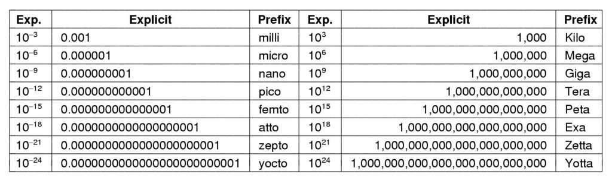

Taller 02: Introducción a los Sistemas Operativos
=================================================

1. Encontrar al menos 5 llamadas al sistema del sistema
   operativo Linux. Indique la funcionalidad de cada una
   de esas llamadas al sistema.

2. Encontrar al menos 3 intérpretes de comandos o *shell* 
   para los sistemas operativos Unix/Linux.

3. Juguemos a convertir unidades:

   a. Convertir un **nano-año** en segundos.
   b. Los micrómetros se llaman comúnmente **micrones**. ¿Cuántos
      metros es un **megramicron**?
   c. ¿Cuántos bytes hay en un 1 Peta byte de memoria?
   d. La masa de la tierra corresponde a 6,000 yotta-gramos. ¿Cuánto
      es eso en kilógramos?

   Figura 2 Prefijos de las unidades métricas
